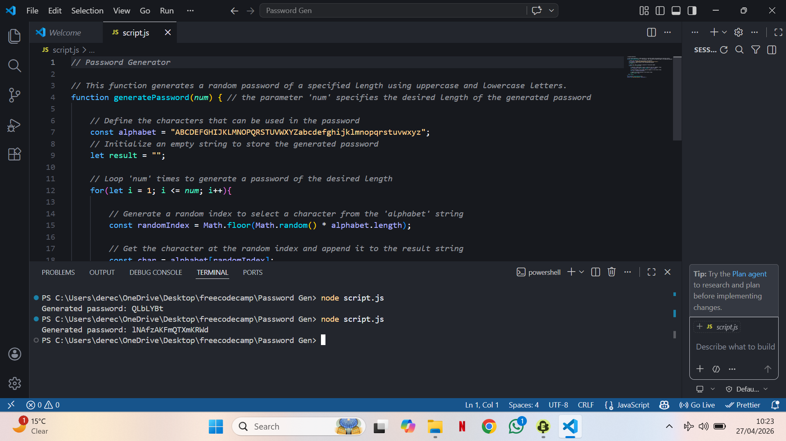

# PASSWORD GEN

## Demo

showcasing an image of the file executed in node.js

## Description
A simple random password generator built fully in Vanilla JavaScript.
It showcases some of the JavaScript core concepts like functions and lopps generating customizable password ideas.

## Features
- Generate strong, random passwords instantly
- Password generated based on the length input
- Customize password length
- Include: both upper case and lower case letters
- Exclude: numbers, symbols

## Tech Used
- Vanilla JavaScript

## How it Works
- it has a pool of characters
- both uppercase and lowercase characters
- randomly picking from it (from both upper and lower case letters)
- it repeats the process N times (num input when calling the function)
- inputs a number that decides the length of the password
- (as it's visible in my screenshot image, I firstly input the number 7 and had a password of 7 characters, then with then number 17, a password long 17 characters)
- it combines the result into a string, returning a secure and unique password of the desired length

## Learnings
- Working with randomization in JavaScript
- Handling user input (just through the code)
- Writing cleaner and reusable functions

## Future Improvements
- Add password strength indicator
- Save previously generated passwords
- Add numbers/symbols to it
- Improve UI/UX

## Disclaimer
All of my projects are for learning purposes. 
While it generates strong passwords, it should not be used for highly sensitive production environments without further security enhancements.

## Author
Yoichi Isagi
